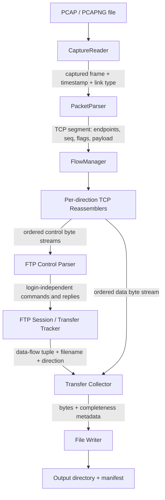

# FTP capture reconstruction architecture

## Goal and scope

Read a packet capture, identify plain FTP transfers, reassemble the corresponding TCP byte streams, and write the transferred bytes as files. The design keeps capture parsing, transport reassembly, FTP state, and file output separate so each layer has a clear responsibility.

The current `main.cpp` implements the first foundation: classic PCAP input, Ethernet/IPv4/TCP parsing, and bidirectional flow summaries. It does not yet perform TCP reassembly or create output files.

## Component diagram



## Component responsibilities

### 1. CaptureReader

- Reads capture metadata and packet records.
- Initially supports classic PCAP with Ethernet link type; detects and reports unsupported PCAPNG or link types.
- Checks every record length before allocating or reading packet data.
- Returns a packet record without interpreting network headers.

### 2. PacketParser

- Parses Ethernet II, IPv4, and TCP using explicit byte reads and big-endian helpers.
- Validates header lengths, IPv4 total length, TCP data offset, and captured frame bounds.
- Ignores unsupported protocols and fragmented IPv4 datagrams in the first version, with counters or diagnostics.
- Produces a `TCPSegment` containing source/destination endpoints, sequence number, flags, payload bytes, and capture timestamp.

### 3. FlowManager

- Canonicalizes endpoint pairs so packets in both directions map to one `TCPFlow`.
- Retains direction for every segment; FTP client/server roles must not be inferred from canonical endpoint order.
- Starts candidate FTP control sessions from TCP port 21. Later, configurable ports or payload-based detection can be added.

### 4. TCPReassembler (one per direction)

- Inserts payload by TCP sequence number rather than capture order.
- Handles retransmissions, duplicates, and overlapping segments without duplicating bytes.
- Exposes contiguous bytes and reports sequence gaps; a stream with gaps is marked incomplete.
- Accounts for SYN consuming one sequence number and FIN consuming one sequence number. Sequence comparisons must use wrap-aware arithmetic.
- Keeps a capture-start-midstream stream explicitly uncertain when the initial sequence boundary is not known.

### 5. FTP Control Parser

- Consumes the reassembled control stream as CRLF-delimited text lines.
- Parses commands and server replies incrementally, including multiline replies.
- Recognizes `TYPE`, `PASV`, `EPSV`, `PORT`, `EPRT`, `RETR`, `STOR`, and `APPE`.
- Redacts `PASS` arguments from logs and diagnostics.
- Does not treat TCP packet boundaries as FTP line boundaries.

### 6. FTP Session / Transfer Tracker

- Tracks client/server roles and transfer state per control connection.
- Remembers passive or active endpoint information from `227`, `229`, `PORT`, or `EPRT` replies/commands.
- Pairs a transfer command with the matching data connection using addresses, ports, direction, and session state.
- Uses the FTP command to determine data direction: `RETR` is server-to-client; `STOR` and `APPE` are client-to-server.
- Uses completion/failure replies such as `226` and `4xx`/`5xx` as control-plane evidence, not as proof that every data byte was captured.

### 7. Transfer Collector and File Writer

- Receives only the reassembled bytes from the selected data direction and writes them in binary mode.
- Does not interpret file formats or convert text encodings or line endings.
- Uses safe generated output names by default; the FTP filename is metadata and must not be allowed to escape the output directory (`../`, absolute paths, separators, and collisions need handling).
- Writes a manifest with source flow, FTP command, byte count, capture completeness, and any observed gaps.
- Writes incomplete captures as explicitly marked partial files, or skips them according to a command-line policy; never labels a gapped stream complete.

## Main data types

```cpp
struct Endpoint {
    IPv4Address address;
    uint16_t port;
};

struct FlowKey {
    Endpoint low;
    Endpoint high;
};

struct TCPSegment {
    Endpoint source;
    Endpoint destination;
    uint32_t sequence;
    uint8_t flags;
    std::vector<uint8_t> payload;
    Timestamp capturedAt;
};

struct ReassembledStream {
    std::vector<uint8_t> bytes;
    bool hasGap;
    std::vector<SequenceGap> gaps;
};

struct FTPTransfer {
    std::string command; // RETR, STOR, or APPE
    std::string remoteName;
    FlowKey dataFlow;
    Direction payloadDirection;
    TransferStatus status;
};
```

These are conceptual interfaces; implementations can change as the parser grows.

## Transfer association example from `ftp-small.pcap`

1. Control flow: `192.168.111.130:37194` ↔ `44.241.66.173:21`.
2. The server's `227` reply advertises `44.241.66.173:1076` because `4 * 256 + 52 = 1076`.
3. The client sends `STOR test.txt` on the control stream.
4. The data flow is `192.168.111.130:46562` → `44.241.66.173:1076`; its 14 payload bytes contain the test file.
5. `226 Transfer complete` marks FTP-level success. The reassembler independently verifies that the captured TCP byte stream has no observed gaps.

## Failure and safety boundaries

- A malformed packet is skipped and counted; it must not crash the whole capture scan.
- An unsupported capture format or link type produces a clear error before packet parsing.
- IPv6, IP fragmentation, VLAN tags, and PCAPNG should be explicit capabilities, not accidental assumptions.
- Missing packets produce incomplete-stream metadata. A successful FTP reply cannot recover bytes absent from the capture.
- Plain FTP credentials are visible in captures. Never log passwords, and treat PCAPs as sensitive input.
- Output paths are generated or sanitized, writes are checked, and an existing output file is not silently overwritten.

## Implementation sequence

1. **Packet foundation:** classic PCAP reader, Ethernet/IPv4/TCP parser, normalized flow report. Implemented in the initial `main.cpp`.
2. **TCP stream layer:** store segments by direction and reassemble using sequence numbers; report gaps and overlap behavior.
3. **FTP control layer:** reconstruct control streams, parse command/reply lines, redact `PASS`.
4. **Transfer tracking:** support passive `PASV`/`EPSV` first and associate one transfer command to the data flow.
5. **File output:** write raw binary bytes, safe filenames, and completeness manifest.
6. **Broaden support:** active FTP, multiple outstanding sessions/transfers, IPv6, VLAN, fragments, and PCAPNG as needed.

The first end-to-end milestone should handle one passive binary upload (`STOR`) like `ftp-small.pcap`; downloads and multiple transfers follow after that path is understood.
